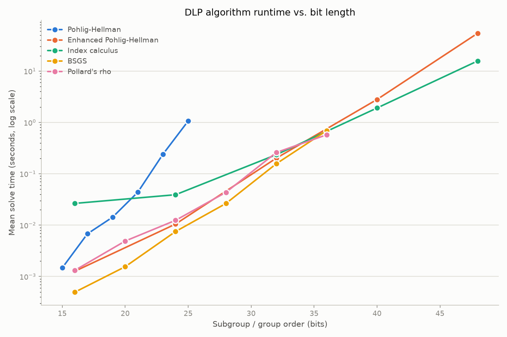
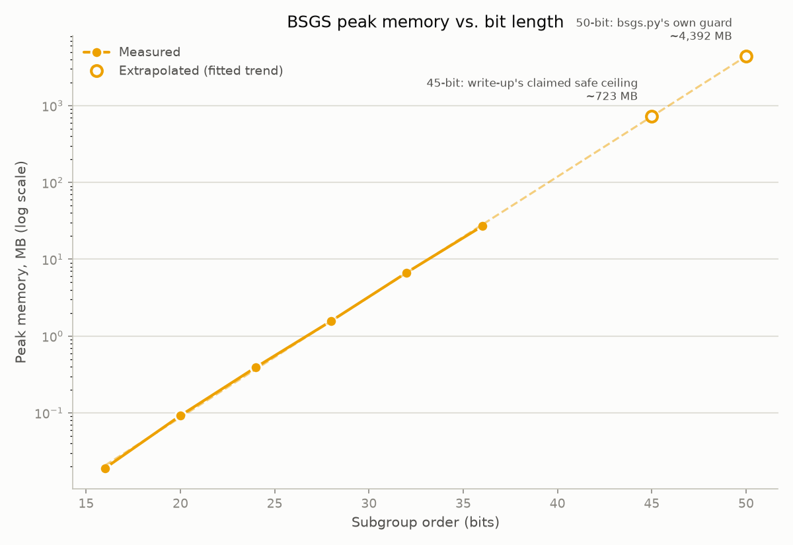

# Cryptanalysis: DLP algorithms and two key-recovery attacks

The discrete logarithm problem: given a group $G$, a generator $g$, and $h = g^x$, find $x$. In the group $(\mathbb{Z}/p\mathbb{Z})^*$ for a large prime $p$, this is believed to be computationally hard. This hardness is the security foundation for Diffie-Hellman key exchange, ElGamal encryption and signatures, and DSA. Everything in `dlp/` solves this problem with a different tradeoff between time, memory, and which group structures it can exploit; everything in `attacks/` and `crypto/` shows what happens when a system built on top of it is, or isn't, parameterized to actually resist them.

## Algorithms (`dlp/`)

| Algorithm                                                   | Idea                                                                                                                   | Complexity                                               | Practical limit measured here                                    |
| ----------------------------------------------------------- | ---------------------------------------------------------------------------------------------------------------------- | -------------------------------------------------------- | ---------------------------------------------------------------- |
| [`pohlig_hellman`](dlp/pohlig_hellman.py)                   | CRT over prime-power subgroups of $\mathbb{Z}/p\mathbb{Z}^*$, brute-forcing each subgroup's discrete log               | $O(q)$ per subgroup, $q$ = largest prime factor of $p-1$ | ~25 bits (code-enforced)                                         |
| [`bsgs`](dlp/bsgs.py)                                       | Baby-step giant-step: precompute a hash table of baby steps, then walk giant steps looking for a match                 | $O(\sqrt{\ell})$ time and space                          | ~50 bits before memory becomes the real constraint               |
| [`pollard_rho`](dlp/pollard_rho.py)                         | Floyd's cycle detection over a pseudorandom walk; prime-order subgroups only                                           | $O(\sqrt{\ell})$ time, $O(1)$ space                      | scales well past 50 bits, no memory wall                         |
| [`enhanced_pohlig_hellman`](dlp/enhanced_pohlig_hellman.py) | Pohlig-Hellman with Pollard's rho substituted for brute force when a subgroup's order exceeds 100                      | $O(\sqrt{q})$ per subgroup instead of $O(q)$             | ~50 bits                                                         |
| [`index_calculus`](dlp/index_calculus.py)                   | Smooth-number factor base + random relation collection + linear algebra mod each prime-power factor of the group order | Subexponential in $p$                                    | scales further than the generic methods above, given enough bits |

## Benchmarks

`benchmarks/bench_dlp.py` generates random DLP instances at increasing bit lengths (via safe primes, so the exact subgroup/group order under test is controlled) and times every algorithm against them; `benchmarks/plot_results.py` renders the CSV into the charts below. Full methodology, including how the randomized algorithms' failure rates are handled, is documented in the scripts themselves.



Plain Pohlig-Hellman climbs steeply and hits a hard stop at 25 bits, the code refuses anything past that, and the trend shows why: it's already the slowest method on screen well before that point. BSGS and Pollard's rho, both generic $O(\sqrt{\ell})$ methods, track each other almost exactly, as expected. Enhanced Pohlig-Hellman and index calculus both extend well past 25 bits and converge to similar cost by ~48 bits, the whole point of substituting Pollard's rho for brute force in the subgroup search.

### BSGS measured memory



The benchmark measures peak memory at safe bit lengths, fits the expected $O(\sqrt{\ell})$ scaling law, and extrapolates. The fitted slope (0.520) matches "~doubling every +2 bits" almost exactly. Extrapolating: **45 bits costs ~723MB** while **50 bits, the code's actual guard, costs ~4.4GB**.

## Attacks (`attacks/`)

### ElGamal nonce-collision key recovery

[`elgamal_key_recovery.py`](attacks/elgamal_key_recovery.py) breaks a signature oracle whose one bug is sampling its nonce $k$ from $[0, \log_2 p]$ instead of uniformly from $\mathbb{Z}/(p-1)\mathbb{Z}$. That tiny nonce space means a birthday-paradox collision. Two different signed messages sharing the same $r = g^k$ turns up after only $O(\sqrt{\log_2 p})$ signature queries, at which point both $k$ and the private key fall out via modular arithmetic.

The attack is probabilistic, the collision it finds doesn't always yield an invertible equation, so `key_recovery_attack()` can legitimately return `None` on any given call; see `tests/test_attacks.py` for a retry wrapper. Example output from a run that succeeded:

```
$ sage --python -c "from attacks.elgamal_key_recovery import key_recovery_attack; print(key_recovery_attack())"
75634685477382510444330864520879772958994529678796910222627902736886490142385035840900624825784171137820168937351129077803696658896294516185852549440076452376282425274587541505371219507459795594844038021894626666390469834141313268358007359600087991446362848017047148793330467454171907456319139352116641008518
```

### Hastad's broadcast attack

[`hastad_broadcast.py`](attacks/hastad_broadcast.py) recovers a plaintext $m$ that's been RSA-encrypted with public exponent $e = 3$ and broadcast to three recipients with distinct, pairwise-coprime moduli. Combining the three ciphertexts via CRT recovers $m^e \pmod{N_1 N_2 N_3}$ exactly, and since $m^e < N_1 N_2 N_3$, an ordinary integer cube root recovers $m$:

```
$ sage --python -c "from attacks.hastad_broadcast import main; main()"
125213347708887948115126001467664467596282356031075701717302323192402682548209853517398481012036934041292536476067163341428270196339024382330146213915725132875663753461936722927533341901433197782705149151335189031955425571430823937555135624597233750204058456400923399067789266312145658948130059887520815157
```

### CTR/XOR keystream recovery ("Fashion Icon")

[`crypto/ctr_xor_recovery.py`](crypto/ctr_xor_recovery.py) recovers a plaintext from a captured CTR-mode ciphertext by re-querying the same oracle and nonce with an all-zero input - since XOR is its own inverse, `0 XOR keystream = keystream`, exposing the raw keystream directly, which then decrypts the original ciphertext.

## What actually defeats these attacks

[`crypto/elgamal.py`](crypto/elgamal.py) is the counterpoint to `elgamal_key_recovery.py`: a correct ElGamal signature scheme (nonce sampled uniformly, checked for invertibility mod $p-1$) plus safe-prime generation (`p = 2q + 1`, staged trial-division → pseudoprime → full primality checks). Parameterizing with a safe prime and working in the order-$q$ subgroup is what makes `enhanced_pohlig_hellman` and `index_calculus` infeasible against it. Both need $p - 1$ to have a large prime factor to have any traction, and a safe prime's only factors are 2 and $q$ itself.

`crypto/finite_fields_demo.py` builds $\mathbb{F}_{2^{10}}$ and runs a small Diffie-Hellman exchange in it, mainly to show why prime fields are preferred in practice: index calculus variants are more effective against small-characteristic fields like $\mathbb{F}_{2^n}$ than against prime fields of comparable size.

## How to run

This project depends on [SageMath](https://www.sagemath.org). The included Nix flake provides a devShell with the exact interpreter everything here was built and tested against:

```
direnv allow   # or, without direnv: nix develop
```

Then:

```
sage --python -m pytest tests/                # correctness tests
sage --python benchmarks/bench_dlp.py         # ~3-4 minutes, writes benchmarks/results/dlp_benchmarks.csv
sage --python benchmarks/plot_results.py      # renders the charts above from that CSV
```

Without Nix: install SageMath directly and make sure `pytest` and `matplotlib` are available inside it (Sage's bundled Python already ships both in recent releases; otherwise `sage --python -m pip install pytest matplotlib`), then run the same commands.

## Layout

```
dlp/          five DLP algorithms
attacks/      the two key-recovery attacks, with any supporting data
crypto/       correct ElGamal, the finite-field/DH demo, CTR/XOR recovery
benchmarks/   the benchmark harness, plotting script, and saved results
tests/        pytest correctness tests for all of the above
```

## License

[MIT](LICENSE).
